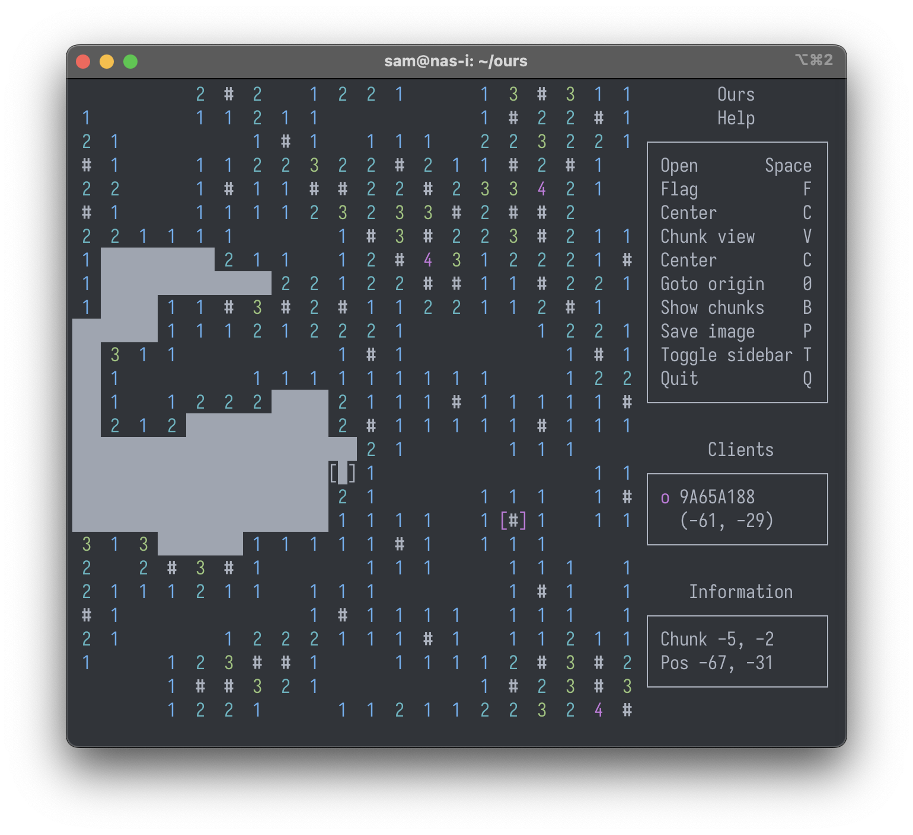

# Ours
Ours is a C++ + ncurses minesweeper clone with multiplayer support.

## Build instructions
Ours requires a number of libraries:

- Boost, including the system, thread and log components
- ncursesw
- freetype2
- protobuf (with proto2 support)
- libpng
- readline
- zlib

If these libraries and development headers are present, building should be as easy as running `make`.
- 
